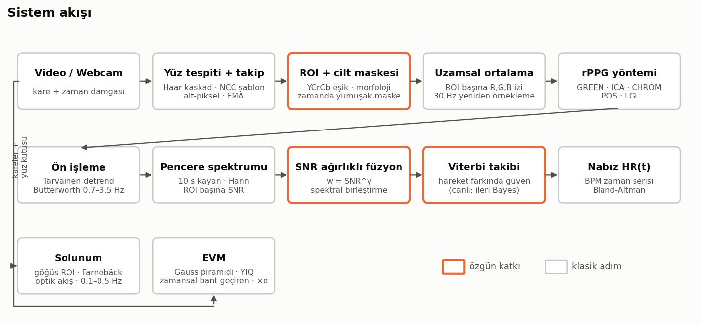
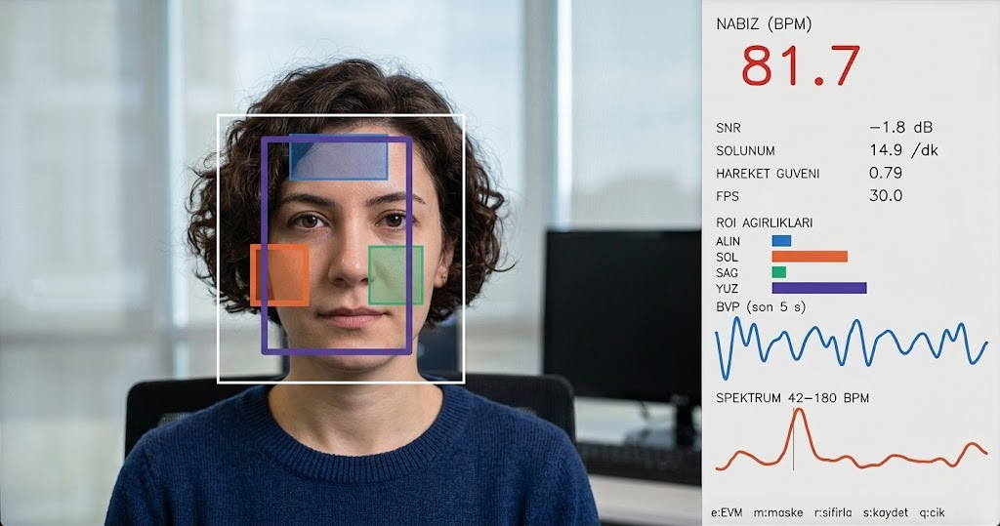
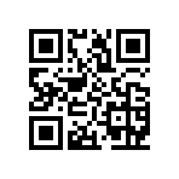

# Temassız Nabız ve Solunum Ölçümü (rPPG)

**Sayısal Görüntü İşleme dönem projesi** — Hayrunnisa Güven, Fırat Üniversitesi Yazılım Mühendisliği

Sıradan bir webcam ile, yüze hiçbir şey takmadan **nabız (BPM)** ve **solunum hızı** ölçen, gerçek zamanlı çalışan bir sistem. Derin öğrenme kullanılmaz; her aşama klasik görüntü ve sinyal işlemeyle çözülür: Haar yüz tespiti, NCC takip, YCrCb cilt segmentasyonu, morfoloji, renk uzayı projeksiyonları, FFT, Butterworth filtre, Gauss piramidi, optik akış.




*Canlı demo arayüzü: yüz ve ROI kutuları (alın, sol/sağ yanak, tüm yüz), anlık nabız, SNR, solunum, hareket güveni, ROI ağırlıkları, son 5 s BVP sinyali ve 42–180 BPM spektrumu.*

---

## Hızlı Başlangıç (Windows)

1. Python 3.9–3.12 kurulu olmalı. Kurulu değilse [python.org](https://www.python.org/downloads/) adresinden yükleyin ve "Add python.exe to PATH" kutusunu işaretleyin. Anaconda da olur.
2. Klasörü açın ve **`KURULUM_WINDOWS.bat`** dosyasına çift tıklayın. Bu dosya:
   - `.venv` sanal ortamını oluşturur,
   - kütüphaneleri kurar,
   - testleri çalıştırır,
   - örnek sentetik videolar üretir.
3. **`CALISTIR.bat`** dosyasına çift tıklayın ve menüden seçim yapın:

```
1) Canlı demo (webcam)
2) Canlı demo - örnek sentetik video (kamera gerekmez)
3) Örnek videoyu analiz et
4) EVM videosu üret (nabzı görünür kıl)
5) Kendi verini kaydet
6) Sentetik benchmark (hızlı)
7) Sentetik benchmark (tam)
8) UBFC-rPPG değerlendirmesi
9) Testleri çalıştır
D) UBFC-rPPG veri setini indir
G) MCD-rPPG indir + değerlendir
```

Linux/macOS için: `bash kurulum.sh`, ardından `source .venv/bin/activate`.

## Mobil Uygulama (telefonda çalışır)



**https://nisagwn.github.io/rppg/** adresini telefonun tarayıcısında açın (ya da QR kodu okutun). Kurulum gerekmez; Android ve iPhone'da çalışır. "Ana ekrana ekle" ile uygulama gibi kullanılır, sonra internetsiz de açılır.

- **Yüz modu (ön kamera):** pico yüz tespiti (klasik, derin öğrenmesiz) → alın/yanak/tüm yüz ROI'leri + YCrCb cilt maskesi → POS → detrend + Butterworth → spektrum → hareket güvenli çevrimiçi Bayes takibi. ROI'ler ortalama füzyonla birleşir; gerçek veride en iyi sonucu bu hat verdi.
- **Parmak modu (arka kamera + flaş):** temaslı PPG. Oksimetre yokken yüz ölçümünü doğrulamak için kullanılabilir.
- Oturum **CSV** olarak indirilebilir (zaman, nabız, SNR, hareket güveni).
- Görüntü telefondan çıkmaz; tüm hesaplama tarayıcıda yapılır.

Sinyal işleme kodu ([`mobile/dsp.js`](mobile/dsp.js)) Python paketinin birebir karşılığıdır. Testler aynı girdide Python ile 1e-9 düzeyinde aynı sonucu verdiğini doğrular. Tarayıcıda uçtan uca test (Chrome'a video sahte kamera olarak verilir):

| Test videosu | Beklenen | Uygulama |
|---|---|---|
| Sentetik yüz, sabit 84 BPM | 84 | 83.6–84.3 BPM, SNR 9.3 dB |
| Sentetik parmak, 96 BPM | 96 | 95.9–96.0 BPM |
| MCD-rPPG gerçek kişi (1020, dinlenme) | parmak PPG | MAE 4.1 BPM (aynı kesitte Python: 3.7) |
| MCD-rPPG gerçek kişi (1024, egzersiz sonrası) | parmak PPG | MAE 4.6 BPM (aynı kesitte Python: 4.4) |

```bash
node --test mobile/test/dsp.test.mjs                                   # Python eşdeğerlik testleri
node mobile/test/e2e.mjs --video yuz.y4m --expect 84 --shot ekran.png  # tarayıcıda uçtan uca
```

## Komut Satırı

```bash
# Canlı demo (e: EVM, m: cilt maskesi, r: sıfırla, s: ekran görüntüsü, q: çıkış)
python scripts/live_demo.py

# Bir videoyu analiz et (grafikler + JSON)
python scripts/run_video.py --video yuz_videosu.mp4
python scripts/run_video.py --video vid.avi --gt ground_truth.txt      # UBFC, metriklerle

# EVM: nabzı görünür kılan video
python scripts/make_evm_video.py --video yuz_videosu.mp4 --alpha 100

# Kendi veri setini topla (bkz. docs/02_veri_toplama_protokolu.md)
python scripts/record_session.py --subject K01 --condition gunisigi_sabit
python scripts/run_video.py --recording data/kayitlar/K01_gunisigi_sabit_<zaman>

# Veri seti (UBFC-rPPG, resmi Google Drive klasöründen)
python scripts/download_ubfc.py --subjects 5
python scripts/evaluate_mcd.py --download 10     # MCD-rPPG: webcam/telefon x dinlenme/egzersiz

# Deneyler
python scripts/synthetic_benchmark.py --seeds 3 --duration 60
python scripts/evaluate_ubfc.py --root data/UBFC
python scripts/mask_experiment.py --image kendi_fotografin.jpg

# Testler
python -m pytest -q
```

## Proje Yapısı

```
rppg/                     çekirdek kütüphane
  roi.py                  Haar tespiti, NCC takip, ROI'ler, YCrCb + morfoloji cilt maskesi
  signals.py              ROI RGB izleri, yumuşak maske (katkı), hareket indeksi, göğüs optik akışı
  methods.py              GREEN, ICA, CHROM, POS, LGI
  filtering.py            Tarvainen detrend, Butterworth, yeniden örnekleme
  hr.py                   spektrum, SNR, spektrogram, Viterbi (katkı), çevrimiçi Bayes takipçi
  fusion.py               SNR ağırlıklı çoklu-ROI füzyon + hareket güveni (katkı)
  pipeline.py             uçtan uca tahmin (Config -> Result)
  respiration.py          solunum hızı
  evm.py                  Eulerian Video Magnification (çevrimdışı + canlı)
  synthetic.py            kontrollü zorluk senaryolu sentetik video üreteci (katkı)
  metrics.py              MAE, RMSE, MAPE, Pearson, Bland-Altman
  evaluation.py           ablasyon ızgarası
  io_utils.py             video, UBFC ve kendi kayıt yükleyicileri
  camera.py               webcam (oto pozlama/beyaz dengesi kilidi)
  plotting.py             rapor şekilleri
scripts/                  çalıştırılabilir betikler (yukarıda)
mobile/                   telefon uygulaması (PWA): index.html, app.js, dsp.js, vendor/pico.js
tests/                    pytest birim + uçtan uca testler
docs/                     öneri, protokol, veri seti, iş planı, RAPOR, sunum
results/                  deney çıktıları (tablolar + şekiller)
```

## Özgün Katkılar

| # | Katkı | Nerede | Ne işe yarar |
|---|---|---|---|
| 1 | SNR ağırlıklı çoklu-ROI **spektral** füzyon | `fusion.py` | Saçla örtülü alın veya ışık vuran yanak gibi bozuk bölgeleri pencere pencere devre dışı bırakır |
| 2 | Hareket farkında güvenle ölçeklenen **Viterbi** takibi (+ canlı ileri Bayes filtresi) | `hr.py`, `fusion.py` | Tek pencerelik sahte tepelere ve hareket anlarına dayanıklı HR serisi |
| 3 | **Zamanda yumuşatılmış ağırlıklı cilt maskesi** | `signals.py` | İkili maskenin ışık titremesini nabız sanması hatasını giderir (deneyle gösterildi) |
| 4 | **Kontrollü zorluk senaryolu sentetik benchmark** | `synthetic.py` | 9 zorluk tipini tek tek ayırarak yöntemleri karşılaştırır |

### Öne çıkan sonuçlar — sentetik / yarı-sentetik

- **POS + önerilen hat:** MAE **0.70 BPM**, r = 0.98, pencerelerin %100'ü ≤5 BPM (27 video, 9 zorluk senaryosu). Klasik POS hattı (tüm yüz + argmax): 1.87 BPM.
- **"Hepsi birden" senaryosu:** klasik 11.6 BPM → önerilen 1.2 BPM (en büyük katkı Viterbi takibinden).
- Önerilen son işleme **beş yöntemin hepsinde** hatayı düşürüyor (%26–87).
- **Maske deneyi (gerçek yüz fotoğrafı):** ikili cilt maskesi %1'lik ışık titremesinde denemelerin **%100'ünde** titremeye kilitleniyor (~33 BPM hata). Yumuşak maske ile hata ≤0.24 BPM.
- Canlı demo 640×480'de ~32 kare/s (CPU).

### Öne çıkan sonuçlar — gerçek veri

**UBFC-rPPG** (DATASET_2, 8 denek, parmak PPG referansı, 10 s pencere):

- Klasik yöntemler (POS, CHROM, ICA, LGI) **1.5–2.0 BPM** MAE, pencerelerin ~%96'sı ≤5 BPM. En iyi: CHROM + alın/yanaklar + SNR füzyonu, **1.53 BPM**. GREEN 7–18 BPM.
- Önerilen son işleme temiz gerçek veride **kazanç sağlamıyor**: POS klasik 1.62, önerilen 1.91 BPM. Nabız hızlı değiştiğinde Viterbi yumuşatması birkaç saniye geriden geliyor.

**MCD-rPPG** (10 kişi, 58 video, 3 kamera × dinlenme / egzersiz sonrası):

| POS MAE (BPM) | klasik | ortalama + Viterbi | önerilen (SNR + Viterbi) |
|---|---:|---:|---:|
| webcam (önden), dinlenme | 5.8 | **4.1** | 5.1 |
| webcam (önden), egzersiz sonrası | 7.9 | **7.6** | 9.2 |
| telefon (Iriun), dinlenme | 16.0 | **12.5** | 14.2 |
| telefon (Iriun), egzersiz sonrası | 18.8 | 19.2 | 22.0 |
| USB kamera (yan), dinlenme | 16.8 | **14.8** | 15.6 |

(4 bölge; "klasik" = ortalama + argmax.)

- **Kamera kalitesi belirleyici:** önden webcam 4–8 BPM, yüksek sıkıştırmalı telefon akışı ve yan açılı USB kamera 12–26 BPM. Yüzler küçük (~70 piksel), telefon videosu 3 dakikada 16 MB. Sentetik "JPEG sıkıştırma" senaryosuyla uyumlu.
- **Viterbi takibi gerçek veride de işe yarıyor** (dinlenmede %12–29 iyileşme). **SNR ağırlıklı füzyon ise gerçek veride genellikle zararlı.** Sentetik veride en güçlü katkı olan füzyon, gerçek bölge gürültüsünde yanlış bölgeye ağırlık verebiliyor.
- Egzersiz sonrasında (ortalama referans 88 BPM, dinlenmede 80 BPM) tüm hatlar kötüleşiyor.

Sonuç dosyaları: [`results/ubfc/SONUCLAR.md`](results/ubfc/SONUCLAR.md), [`results/mcd/SONUCLAR.md`](results/mcd/SONUCLAR.md), [`results/synthetic/SONUCLAR.md`](results/synthetic/SONUCLAR.md), [`results/maske_deneyi/SONUCLAR.md`](results/maske_deneyi/SONUCLAR.md). Ayrıntılı tartışma: [`docs/05_rapor.md`](docs/05_rapor.md).

## Dokümanlar

| Dosya | İçerik |
|---|---|
| [`docs/01_proje_onerisi.md`](docs/01_proje_onerisi.md) | Hocaya sunulacak proje önerisi |
| [`docs/02_veri_toplama_protokolu.md`](docs/02_veri_toplama_protokolu.md) | Kayıt koşulları, onam formu, KVKK |
| [`docs/03_veri_seti_indirme.md`](docs/03_veri_seti_indirme.md) | UBFC-rPPG ve rPPG-Toolbox (derin öğrenme karşılaştırması) |
| [`docs/04_is_plani.md`](docs/04_is_plani.md) | 12 haftalık plan ve kontrol listesi |
| [`docs/05_rapor.md`](docs/05_rapor.md) / `.docx` | Dönem raporu (sentetik sonuçlarla dolu; UBFC ve kendi veri bölümleri doldurulacak) |
| [`docs/06_sunum_taslagi.md`](docs/06_sunum_taslagi.md) | Slayt slayt sunum planı ve demo kontrol listesi |

## Sorun Giderme

| Sorun | Çözüm |
|---|---|
| "Kamera açılamadı" | Başka bir uygulama (Teams, Zoom) kamerayı kullanıyor olabilir; kapatın. Farklı kamera için `--camera 1` deneyin. |
| "YÜZ BULUNAMADI" | Yüzünüz önden ve iyi aydınlatılmış olmalı. Haar kaskadı profilden yüz bulmaz. |
| Nabız saçma değerlerde geziniyor | 10 s bekleyin (ısınma). Hareketsiz durun. Arkadan gelen ışıktan (pencere arkada) kaçının. Floresan titremesi varsa masa lambası kullanın. |
| Değer sürekli sabit ve yanlış | Kameranın otomatik pozlaması kilitlenmemiş olabilir; `--no-lock` ile ya da Windows Kamera ayarlarından deneyin. |
| `pip install` hatası | Python 3.13/3.14 kullanıyorsanız bazı paketlerin hazır sürümleri olmayabilir; 3.11 veya 3.12 önerilir. Kurulum betiği önce bunları arar. |
| `module 'cv2' has no attribute 'CascadeClassifier'` | OpenCV 5 kurulmuş; OpenCV 5 Haar kaskadını kaldırdı. `pip install "opencv-python>=4.8,<5"` (requirements.txt bunu zaten sabitler). |

## Kaynaklar

Tam kaynakça raporun sonundadır. Temel kaynaklar: Verkruysse vd. 2008; Poh vd. 2010; de Haan ve Jeanne 2013; Wang vd. 2017; Pilz vd. 2018; Wu vd. 2012; Bobbia vd. (UBFC-rPPG); Liu vd. 2023 (rPPG-Toolbox).
