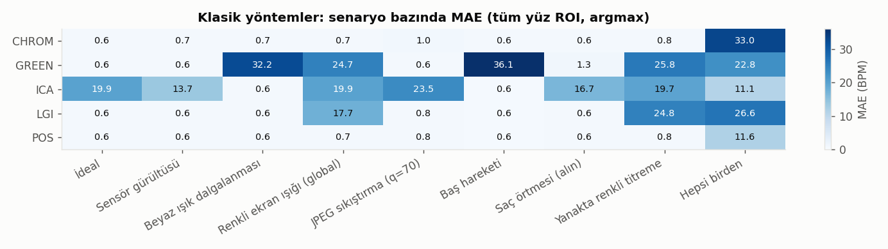
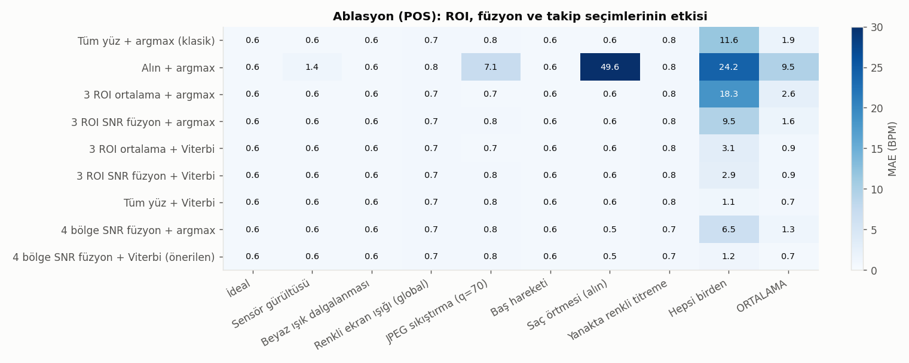
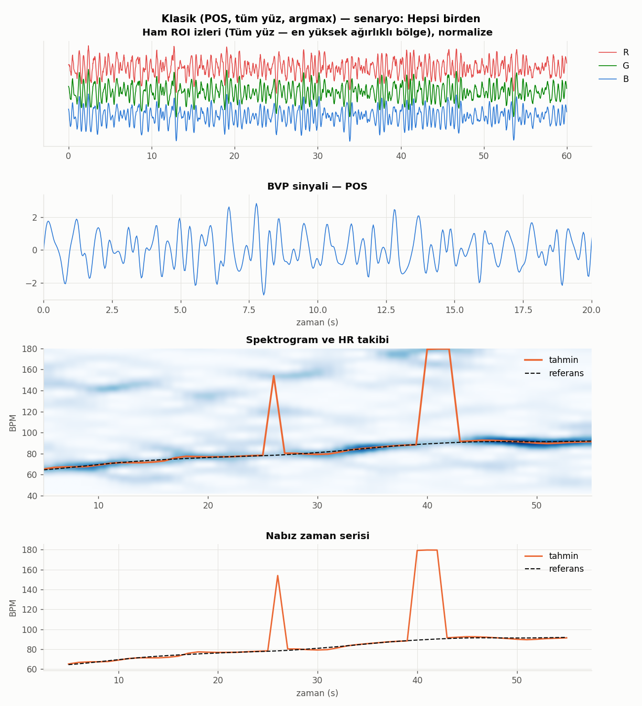
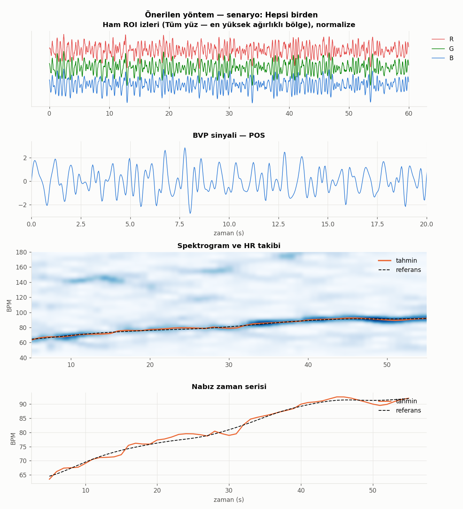
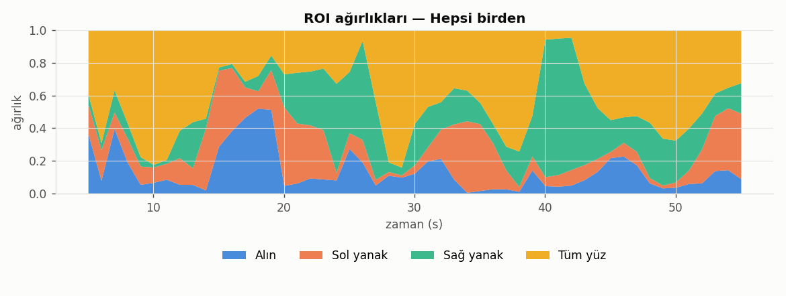
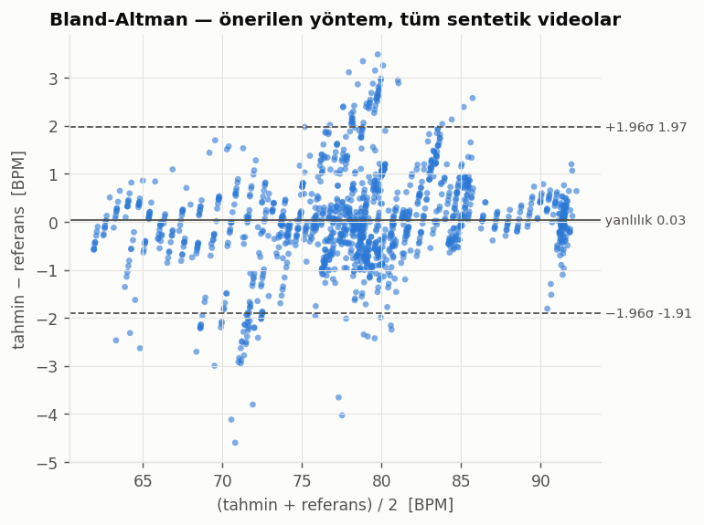
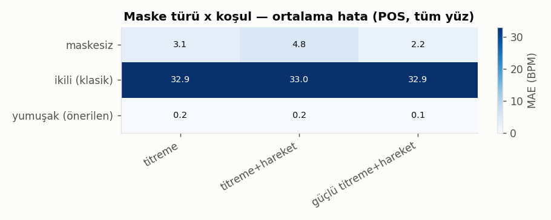

# Özet

Bu çalışmada sıradan bir webcam videosundan nabız ve solunum hızını temassız olarak ölçen, tamamen klasik görüntü ve sinyal işleme tekniklerine dayanan bir sistem geliştirilmiştir. Sistemin aşamaları şunlardır:

- Viola-Jones yüz tespiti ve normalize çapraz korelasyonla takip
- YCrCb uzayında morfolojik olarak temizlenmiş cilt segmentasyonu
- Bölge başına uzamsal ortalama
- Beş klasik rPPG yöntemi (GREEN, ICA, CHROM, POS, LGI)
- Tarvainen trend giderme, Butterworth bant geçiren filtre ve frekans domeninde nabız tahmini
- Farnebäck optik akışı ile solunum ölçümü
- Eulerian Video Magnification (EVM) ile nabzın görselleştirilmesi

Literatürdeki temel hatta dört iyileştirme önerilmiştir:

1. **SNR ağırlıklı çoklu-ROI spektral füzyon.** Her zaman penceresinde en temiz sinyali veren yüz bölgesi baskın olur.
2. **Hareket farkında güvenle ölçeklenen Viterbi HR takibi.** Tek pencerelik sahte tepeleri bastırır.
3. **Zamanda yumuşatılmış ağırlıklı cilt maskesi.** Her karede yeniden hesaplanan ikili maskenin ışık titremesini nabız sanmasına yol açan doğrusal olmama sorununu giderir.
4. **Kontrollü zorluk senaryolu sentetik benchmark.** Gürültü, ışık, renkli ekran ışığı, sıkıştırma, hareket, örtme ve yerel titreme etkilerini tek tek ayırarak ölçmeyi sağlar.

Sonuçlar sentetik benchmark ve gerçek yüz fotoğrafından üretilmiş yarı-sentetik deney üzerinde sunulmuştur. UBFC-rPPG ve kendi toplanan veriler için değerlendirme betikleri hazırdır (bkz. Bölüm 6).

**Anahtar kelimeler:** uzaktan fotopletismografi, rPPG, renk uzayı, cilt segmentasyonu, morfoloji, frekans analizi, Viterbi, Eulerian video büyütme

# 1. Giriş

Kalbin her atımında arterlere pompalanan kan, deri altındaki mikrodamarlarda kan hacmini periyodik olarak artırır. Oksijenli ve oksijensiz hemoglobin görünür ışığı, özellikle yeşil bölgede (~540–580 nm), güçlü biçimde soğurur. Bu nedenle deriden yansıyan ışık kalp atımıyla çok küçük oranda değişir. Parmağa takılan pulse oksimetreler bu ilkeyle (fotopletismografi, PPG) çalışır.

Verkruysse ve arkadaşları (2008), aynı sinyalin sıradan bir kamerayla ve ortam ışığıyla metrelerce uzaktan ölçülebildiğini göstermiştir. Bu tekniğe **uzaktan fotopletismografi (rPPG)** denir.

rPPG'nin görüntü işleme açısından zorluğu, aranan sinyalin son derece küçük olmasıdır. Piksel değerlerindeki nabız kaynaklı değişim tipik olarak **0.1–0.5 gri seviyedir**. Buna karşılık kamera gürültüsü birkaç gri seviye, baş hareketi ve ışık değişimleri ise onlarca gri seviyedir. Bu nedenle sistem aşağıdaki klasik tekniklerin dikkatli bir birleşimine dayanır:

- Uzamsal ortalama ile gürültünün bastırılması
- Renk uzayı projeksiyonlarıyla ışık ve hareket etkilerinin ayrılması
- Frekans domeninde nabız bandının seçilmesi

Bu yüzden rPPG, bir görüntü işleme dersinin konularını tek bir uçtan uca problemde birleştirmek için uygun bir konudur.

## 1.1 Katkılar

1. Beş klasik yöntemin aynı hat içinde, aynı ön ve son işleme ile uygulanması ve karşılaştırılması.
2. **SNR ağırlıklı çoklu-ROI spektral füzyon** (Bölüm 3.6).
3. **Hareket farkında güvenle ölçeklenen Viterbi takibi** ve canlı sistem için onun çevrimiçi eşi olan ileri Bayes filtresi (Bölüm 3.7).
4. **Zamanda yumuşatılmış ağırlıklı cilt maskesi.** İkili maskenin ışık titremesini nabız sanmasının deneysel gösterimi ve çözümü (Bölüm 3.3).
5. **Kontrollü zorluk senaryolu sentetik benchmark**, 9 senaryo (Bölüm 4.1).
6. Gerçek zamanlı canlı demo (nabız, solunum, ROI ağırlıkları, EVM) ve veri toplama protokolü.

# 2. İlgili Çalışmalar

**GREEN** (Verkruysse vd., 2008). Yüz bölgesinin yeşil kanal ortalaması tek başına nabız taşır. Basittir, ancak ışık değişimlerine ve harekete karşı savunmasızdır.

**ICA** (Poh vd., 2010). Normalize R, G, B izlerine Bağımsız Bileşen Analizi (FastICA) uygulanır ve nabız bandında en baskın tepeye sahip bileşen seçilir.

**CHROM** (de Haan ve Jeanne, 2013). Beyaz ışık altında speküler yansımanın tüm kanallarda eşit olduğu varsayımıyla iki krominans sinyali tanımlanır:

$X = 3R - 2G$, $Y = 1.5R + G - 1.5B$

Bu sinyaller bant geçiren filtreden geçirilir ve $S = X_f - \alpha Y_f$ ($\alpha = \sigma(X_f) / \sigma(Y_f)$) ile birleştirilir.

**POS** (Wang vd., 2017). Normalize RGB uzayında cilt tonuna dik bir düzlem tanımlanır:

$P = \begin{bmatrix}0 & 1 & -1\\ -2 & 1 & 1\end{bmatrix}$

Kısa pencerelerde $h = S_1 + (\sigma_1 / \sigma_2) S_2$ hesaplanıp örtüşmeli toplama ile birleştirilir. Yoğunluk değişimi $[1,1,1]$ yönünde olduğu için $P$ tarafından tamamen yok edilir.

**LGI** (Pilz vd., 2018). Pencere içi verinin baskın tekil vektörü (yoğunluk yönü) izdüşümle atılır; yerel grup değişmezliği sağlanır.

**Eulerian Video Magnification** (Wu vd., 2012). Piksel zaman serilerine uzamsal piramit ve zamansal bant geçiren filtre uygulanıp büyütülür; nabız gözle görülür hale gelir.

**Bölge seçimi ve ağırlıklandırma.** DistancePPG (Kumar vd., 2015), yüz bölgelerini bir iyilik ölçütüne göre ağırlıklandırarak birleştirmenin sinyal kalitesini artırdığını göstermiştir. Bu çalışmadaki füzyon, benzer fikri **spektral düzeyde ve pencere pencere** uygular.

**Spektral tepe takibi.** Bilek tipi PPG'de hareket altında HR takibi için spektral tepe izleme yaygın bir fikirdir (ör. TROIKA; Zhang vd., 2015). Bu çalışmada Viterbi tabanlı global en iyi yol bulma, **hareket indeksinden türetilen pencere güveniyle** birleştirilmiştir.

**Veri setleri ve araç kutuları.** UBFC-rPPG (Bobbia vd.) 42 denekli standart bir benchmark'tır. rPPG-Toolbox (Liu vd., 2023) klasik ve derin öğrenme yöntemlerini ortak bir çerçevede sunar.

**Cilt tonu.** Nowara vd. (2020), koyu cilt tonlarında rPPG başarımının düştüğünü meta-analizle göstermiştir.

# 3. Yöntem


Sistem sırasıyla şu adımlardan oluşur:

1. Kare okuma
2. Yüz tespiti ve takibi
3. ROI tanımları ve yumuşak cilt maskesi
4. Uzamsal ortalama ile $(N \times 3)$ RGB izleri; zaman damgası varsa 30 Hz'e yeniden örnekleme
5. rPPG yöntemi ile BVP
6. Trend giderme, bant geçiren filtre ve z-skor
7. Kayan pencere spektrumu ve bölge başına SNR
8. SNR ağırlıklı spektral füzyon
9. Hareket güveniyle Viterbi takibi ile HR(t)
10. Paralel kol: göğüs bölgesinde optik akış ile solunum hızı

## 3.1 Yüz Tespiti ve Takibi

Yüz, **Viola-Jones** Haar kaskad sınıflandırıcısıyla (OpenCV `haarcascade_frontalface_default`) her 15 karede bir tespit edilir. Tespitler arası karelerde yüzün iç bölgesinden alınan şablon, bir arama penceresinde **normalize çapraz korelasyon (NCC)** ile eşlenir. Tepe konumu parabolik enterpolasyonla **alt-piksel** hassasiyete getirilir.

Haar tespitlerindeki kare kare titreşim ROI sınırlarında piksel giriş-çıkışına ve bu yoluyla sinyale gürültüye yol açar. Bu nedenle tespitler **üstel hareketli ortalama** (β = 0.7) ile yumuşatılır.

**Hareket indeksi** iki terimin toplamıdır:

$m_t = \frac{\lVert c_t - c_{t-1} \rVert}{w} + \frac{1}{255}\,\overline{|F_t - F_{t-1}|}$

İlk terim yüz kutusu merkezinin yer değiştirmesidir (yüz genişliğine oranla). İkinci terim, 64×64'e ölçeklenmiş yüz içindeki ortalama mutlak kare farkıdır; ifade değişimi ve konuşmayı yakalar.

## 3.2 İlgi Bölgeleri (ROI)

Yüz kutusuna göre oransal dört bölge tanımlanır: **alın**, **sol yanak**, **sağ yanak** ve **tüm yüz**. Alın ve yanaklar perfüzyonu yüksek, göz, ağız ve kaş gibi hareketli yapılardan uzak bölgelerdir.

## 3.3 Cilt Segmentasyonu ve Yumuşak Maske (Katkı 4)

Her ROI yamasında YCrCb uzayında aralık eşiklemesi uygulanır:

$133 \le Cr \le 173$, $77 \le Cb \le 127$, $40 \le Y \le 240$

Y alt ve üst sınırları çok karanlık pikselleri ve speküler parlamaları dışlar. Ardından 3×3 eliptik yapı elemanıyla **morfolojik açma** (küçük yanlış pozitifleri siler) ve **kapama** (küçük boşlukları doldurur) uygulanır.

**Tespit edilen sorun.** Klasik uygulamada bu ikili maske her karede yeniden hesaplanır ve ortalama yalnızca maskelenmiş piksellerden alınır. Oysa eşik sınırına yakın pikseller (Y ≈ 40 olan gölge ve saç kenarları, Y ≈ 240 olan parlamalar) ortam ışığı yüzde birkaç değiştiğinde maskeye girip çıkar. Bu piksellerin rengi ortalama cilt renginden farklı olduğundan, **ROI ortalamasının rengi ışık titremesi frekansında değişir**. Bu, POS/CHROM'un temel varsayımını bozar: bu yöntemler yoğunluk değişiminin tüm kanallarda orantılı olduğunu ($[1,1,1]$ yönünde) varsayar ve onu projeksiyonla yok eder. Maskenin yarattığı değişim ise bu yönde değildir; projeksiyonu geçer ve **titreme nabız sanılır**. Bölüm 5.3'te bunun gerçek bir yüz fotoğrafında sistematik olarak gerçekleştiği gösterilmiştir.

**Çözüm.** Maske ROI'ye göre normalize edilmiş sabit bir 32×32 ızgarada tutulur ve üstel ortalamayla güncellenir:

$p_t = \beta\, p_{t-1} + (1-\beta)\, m_t, \quad \beta = 0.98$

Ortalama bu olasılık haritasıyla **ağırlıklı** alınır:

$\bar{C}_t = \dfrac{\sum_x p_t(x)\, C_t(x)}{\sum_x p_t(x)}$

Eşikleme ortadan kalktığı için ortalama piksel değerlerinde doğrusaldır. $p_t$'nin kendisi de yavaş değişir: 1.7 Hz'lik bir titremenin maskeye sızması $|H(e^{j\omega})| = \frac{1-\beta}{|1-\beta e^{-j\omega}|} \approx 0.057$, yani yaklaşık **17 kat** azalır. Zaman sabiti yaklaşık 1.7 s olduğu için maske, baş hareketi ve ifade değişimlerine yine de uyum sağlar.

## 3.4 rPPG Yöntemleri

Beş yöntem Bölüm 2'deki tanımlarıyla uygulanmıştır. POS, CHROM ve LGI 1.6 s'lik Hann pencereli örtüşmeli toplama kullanır. ICA'da FastICA'nın 3 bileşeni arasından, 0.7–3.5 Hz bandındaki en yüksek periyodogram tepesinin toplam güce oranı en büyük olan bileşen seçilir.

## 3.5 Ön İşleme ve Spektral Analiz

- **Trend giderme:** Tarvainen vd. (2002) düzgünlük önselli yöntem, $z_{trend} = (I + \lambda^2 D_2^T D_2)^{-1} z$, λ = 100. Seyrek matrislerle çözülür.
- **Bant geçiren filtre:** 3. dereceden Butterworth, 0.7–3.5 Hz (42–210 BPM), ileri-geri uygulanır (sıfır faz).
- **Spektrum:** Hann pencereli periyodogram, sıfır dolgu ile yaklaşık 0.25 BPM ham çözünürlük, 0.5 BPM'lik ızgaraya örneklenir. Tepe konumu parabolik enterpolasyonla bulunur.
- **SNR** (de Haan ve Jeanne, 2013): Temel frekansın ±6 BPM'i ve ilk harmoniğin ±12 BPM'i içindeki güç, bandın geri kalanına oranlanır (dB).
- **Kayan pencere:** 10 s pencere, 1 s adım.

## 3.6 SNR Ağırlıklı Çoklu-ROI Spektral Füzyon (Katkı 1)

Her ROI $r$ ve pencere $t$ için normalize spektrum $S_r(t,f)$ ve $\mathrm{SNR}_r(t)$ hesaplanır. Füzyon şöyle tanımlanır:

$w_r(t) = \big(10^{\mathrm{SNR}_r(t)/10}\big)^{\gamma}, \quad S(t,f) = \dfrac{\sum_r w_r(t)\, S_r(t,f)}{\sum_r w_r(t)}, \quad \gamma = 2$

Varsayılan aday bölgeler alın, iki yanak ve **tüm yüz**dür; tüm yüzün aday olarak eklenmesinin gerekçesi Bölüm 5.2'de verilmiştir.

RGB ortalamasının füzyonundan (klasik yaklaşım) farkı şudur: bozuk bir bölge ortalamayı **kirletmez**, yalnızca ağırlığı düşer. Ağırlıklar zamanla değişebilir; örneğin kişi başını çevirdiğinde veya bir yanağa ekran ışığı vurduğunda sistem uyum sağlar.

## 3.7 Hareket Farkında Viterbi Takibi (Katkı 2)

Pencere başına bağımsız argmax, tek bir gürültülü pencerede HR'ı 40–60 BPM zıplatabilir. Fizyolojik olarak HR saniyede birkaç BPM'den hızlı değişmez. Spektrogram bir gizli Markov modelinin gözlem olasılıkları gibi yorumlanır:

- **Gözlem:** $\log E_t(f) = c_t \cdot \log\big(S(t,f)/\max_f S(t,f)\big)$
- **Geçiş:** $\log A(f_i, f_j) = -\tfrac{1}{2}\big((f_i - f_j)/\sigma\big)^2$, $\sigma = \max(1.5,\ 4\,\text{BPM/s} \cdot \Delta t)$
- **Pencere güveni:** $c_t = \dfrac{1}{1 + (\bar{m}_t / m_{ref})^2}$, $m_{ref} = 2\cdot\mathrm{medyan}(\bar m)$

En olası yol dinamik programlamayla bulunur. Yüksek hareketli pencerelerde $c_t$ küçüldüğü için gözlem düzleşir ve yol önceki eğilimi sürdürür.

Canlı sistemde aynı model **ileri Bayes filtresi** olarak çalışır: inanç Gauss çekirdekle konvolüsyonla tahmin edilir, ardından $S^{c_t}$ ile çarpılarak güncellenir.

## 3.8 Solunum Hızı

Yüz kutusunun altındaki göğüs bölgesinde **Farnebäck yoğun optik akışı** hesaplanır. Dikey bileşenin medyanı kare başına alınır ve kümülatif toplamı göğüs yer değiştirmesini verir. Bu sinyal sırasıyla trend gidermeden, 0.1–0.5 Hz bant geçiren filtreden ve 30 s pencereli spektrumdan (6–30 nefes/dk) geçirilir. Göğüs görünmüyorsa yedek sinyal olarak yüz merkezinin dikey konumu kullanılır.

## 3.9 Eulerian Video Magnification

Kareler YIQ uzayına çevrilir ve Gauss piramidinin 3–4. seviyesine indirilir (uzamsal alçak geçiren). Her piksel zaman serisine 0.8–2.0 Hz ideal (FFT maskeli) bant geçiren filtre uygulanır, α = 50–120 ile büyütülür, orijinal çözünürlüğe geri ölçeklenip eklenir. Canlı sürümde ideal filtre yerine piksel başına durum tutan 2. dereceden IIR Butterworth kullanılır.

# 4. Deney Düzeni

## 4.1 Sentetik Benchmark (Katkı 5)

Gerçek veri setlerinde zorluklar iç içe geçmiştir; hangi yöntemin hangi zorluğa dayanıklı olduğunu ayırmak zordur. Bu nedenle bilinen HR ve solunum hızıyla yüz videoları üreten bir üreteç yazılmıştır.

Model şöyledir:

$C(x,t) = u_c\, I_0(x)\,\big(1 + a\, g(x)\, p_c\, \mathrm{pulse}(t)\big)\, L(t) + \mathrm{spec}(t) + n$

Burada $p = [0.33, 0.77, 0.53]$ (R, G, B) nabız rengi vektörü, $g(x)$ bölgesel perfüzyon haritası ve $a = 0.0018$'dir. Bu genlik nabzı ~0.3 gri seviyeye karşılık gelir, yani tek pikselde görünmez.

- HR yavaşça artar (ör. 70 → 95 BPM) ve bant sınırlı rastgele dalgalanma içerir.
- Nabız dalga biçimi dikrotik çentik benzeri harmonikler içerir.
- Nefes, göğsü ve başı dikey olarak hareket ettirir.

| Senaryo | Açıklama |
|---|---|
| İdeal | Yalnızca hafif gürültü ve nefesle baş hareketi |
| Sensör gürültüsü | σ = 6 gri seviye |
| Beyaz ışık dalgalanması | Nabız bandında %1.2 genlikli global yoğunluk değişimi |
| Renkli ekran ışığı | Mavimsi, nabız bandında global titreme |
| JPEG sıkıştırma | q = 70 (MJPG webcam akışı gibi) |
| Baş hareketi | 8 px öteleme ve hıza bağlı speküler parlama |
| Saç örtmesi | Alın saçla kapalı (nabız taşımayan bölge) |
| Yanakta renkli titreme | Tek yanağa vuran %8 genlikli renkli ışık |
| Hepsi birden | Yukarıdakilerin birleşimi |

Her senaryo 3 farklı tohumla (farklı HR eğrisi ve solunum hızı) 60 s olarak üretilmiştir; toplam 27 video. Değerlendirilen konfigürasyonlar:

- **Yöntemler:** 5
- **ROI kümeleri:** alın, yanaklar, tüm yüz, alın+yanaklar
- **Füzyon:** RGB ortalaması veya SNR
- **Takip:** argmax veya Viterbi + hareket güveni

## 4.2 Yarı-Sentetik Maske Deneyi

Gerçek bir portre fotoğrafına bilinen HR'de nabız rengi (%0.3), nabızdan ayırt edilebilir frekansta beyaz ışık titremesi (%1–2) ve baş ötelemesi (6 px) eklenmiştir. Her koşul için rastgele HR ve titreme frekansıyla 6 deneme yapılmıştır. Üç maske modu karşılaştırılmıştır: maskesiz, ikili ve yumuşak. Yüz Haar ile otomatik bulunmuştur.

## 4.3 Metrikler

- MAE, RMSE (BPM), MAPE (%)
- Pearson r
- ≤5 BPM pencere oranı (%)
- Bland-Altman yanlılığı ve %95 uyum sınırları
- Video düzeyi mutlak hata

Pencere düzeyi metrikler 10 s pencere ve 1 s adım ile hesaplanır.

# 5. Sonuçlar

> **Önemli not:** Bu bölümdeki sayısal sonuçlar **sentetik** ve **yarı-sentetik** verilere aittir. Sentetik veri gerçek videolara göre iyimserdir: yüz rijittir, takip kusursuza yakındır, nabız dalga biçimi idealdir. Sonuçlar mutlak doğruluk olarak değil, **yöntemlerin hangi zorluğa nasıl tepki verdiğinin karşılaştırması** olarak okunmalıdır. Gerçek veri (UBFC-rPPG ve kendi kayıtlarımız) sonuçları Bölüm 6'daki betiklerle üretilip buraya eklenecektir.

## 5.1 Klasik Yöntemlerin Senaryolara Tepkisi

Tablo 1: Tüm yüz ROI ve pencere başına argmax (klasik hat) ile yöntem × senaryo MAE (BPM). 9 senaryo × 3 tohum × 60 s.

|       |   İdeal |   Sensör gürültüsü |   Beyaz ışık dalgalanması |   Renkli ekran ışığı (global) |   JPEG sıkıştırma (q=70) |   Baş hareketi |   Saç örtmesi (alın) |   Yanakta renkli titreme |   Hepsi birden |
|:------|--------:|-------------------:|--------------------------:|------------------------------:|-------------------------:|---------------:|---------------------:|-------------------------:|---------------:|
| CHROM |    0.58 |               0.66 |                      0.7  |                          0.74 |                     1.01 |           0.59 |                 0.63 |                     0.77 |          32.97 |
| GREEN |    0.58 |               0.57 |                     32.2  |                         24.72 |                     0.6  |          36.13 |                 1.26 |                    25.85 |          22.81 |
| ICA   |   19.93 |              13.71 |                      0.59 |                         19.93 |                    23.53 |           0.56 |                16.67 |                    19.66 |          11.07 |
| LGI   |    0.57 |               0.63 |                      0.58 |                         17.65 |                     0.83 |           0.56 |                 0.57 |                    24.83 |          26.55 |
| POS   |    0.57 |               0.6  |                      0.58 |                          0.74 |                     0.8  |           0.56 |                 0.57 |                     0.76 |          11.63 |



Gözlemler:

- **GREEN** beyaz ışık dalgalanmasında (32.2 BPM), renkli ekran ışığında, baş hareketinde (36.1 BPM) ve yerel titremede tamamen başarısızdır. Tek kanal yoğunluk değişimini nabızdan ayıramaz.
- **POS** ve **CHROM**, beyaz ışık dalgalanmasını ve speküler parlamayı başarıyla bastırır (≤0.8 BPM). Bu, $[1,1,1]$ yoğunluk yönünün projeksiyonla yok edilmesinin doğrudan sonucudur.
- **LGI** beyaz ışıkta başarılıdır, ancak **renkli** ışık bozucularında (ekran ışığı 17.7 BPM, yerel titreme 24.8 BPM) başarısızdır. Renkli bozucu yoğunluk yönünde değildir; LGI yalnızca baskın bileşeni attığı için onu geçirir. POS ise sabit, cilt tonuna dayalı düzlemi sayesinde bu bozucuları da büyük ölçüde bastırır.
- **ICA** kararsızdır. İdeal senaryoda bile 19.9 BPM hata yapar, çünkü FastICA'nın bileşen seçimi nefesle oluşan baş hareketinin harmoniklerine kayabilir. Poh vd. (2010) sonrası literatürde de ICA'nın bileşen seçiminin kırılganlığı bilinmektedir.
- **"Hepsi birden"** senaryosunda en iyi klasik yöntem (POS) bile 11.6 BPM hata yapar. Bu hata pencere bazlı argmax'in tek pencerelik sahte tepelere kapılmasından kaynaklanır (aşağıdaki "Klasik hat" şekli).

## 5.2 Ablasyon: ROI, Füzyon ve Takip

Tablo 2: POS yöntemiyle ROI kümesi, füzyon ve takip seçimlerinin etkisi (MAE, BPM).

|                                         |   İdeal |   Sensör gürültüsü |   Beyaz ışık dalgalanması |   Renkli ekran ışığı (global) |   JPEG sıkıştırma (q=70) |   Baş hareketi |   Saç örtmesi (alın) |   Yanakta renkli titreme |   Hepsi birden |   ORTALAMA |
|:----------------------------------------|--------:|-------------------:|--------------------------:|------------------------------:|-------------------------:|---------------:|---------------------:|-------------------------:|---------------:|-----------:|
| Tüm yüz + argmax (klasik)               |    0.57 |               0.6  |                      0.58 |                          0.74 |                     0.8  |           0.56 |                 0.57 |                     0.76 |          11.63 |       1.87 |
| Alın + argmax                           |    0.57 |               1.36 |                      0.63 |                          0.78 |                     7.15 |           0.65 |                49.55 |                     0.81 |          24.15 |       9.52 |
| 3 ROI ortalama + argmax                 |    0.56 |               0.62 |                      0.59 |                          0.74 |                     0.7  |           0.58 |                 0.58 |                     0.78 |          18.35 |       2.61 |
| 3 ROI SNR füzyon + argmax               |    0.56 |               0.62 |                      0.59 |                          0.74 |                     0.81 |           0.58 |                 0.56 |                     0.76 |           9.45 |       1.63 |
| 3 ROI ortalama + Viterbi                |    0.56 |               0.62 |                      0.59 |                          0.74 |                     0.7  |           0.58 |                 0.58 |                     0.78 |           3.09 |       0.92 |
| 3 ROI SNR füzyon + Viterbi              |    0.56 |               0.62 |                      0.59 |                          0.74 |                     0.81 |           0.58 |                 0.56 |                     0.76 |           2.88 |       0.9  |
| Tüm yüz + Viterbi                       |    0.57 |               0.6  |                      0.58 |                          0.74 |                     0.8  |           0.56 |                 0.57 |                     0.76 |           1.15 |       0.7  |
| 4 bölge SNR füzyon + argmax             |    0.56 |               0.58 |                      0.58 |                          0.74 |                     0.76 |           0.56 |                 0.55 |                     0.74 |           6.54 |       1.29 |
| 4 bölge SNR füzyon + Viterbi (önerilen) |    0.56 |               0.58 |                      0.58 |                          0.74 |                     0.76 |           0.56 |                 0.55 |                     0.74 |           1.22 |       0.7  |



**Takibin etkisi en büyüktür.** Viterbi + hareket güveni, "hepsi birden" senaryosunda tüm yüz hattının hatasını 11.63 BPM'den 1.15 BPM'e, 3 ROI ortalamasınınkini 18.35 BPM'den 3.09 BPM'e indirir. "Klasik hat" şeklinde klasik hattın 26. ve 40–43. saniyelerdeki 150–180 BPM'lik sıçramaları görülmektedir; Viterbi bu pencereleri fizyolojik geçiş kısıtıyla yok sayar.





**Bölge seçiminin etkisi.** Yalnızca alın kullanmak, alın saçla örtüldüğünde çöker (49.6 BPM). SNR füzyonu argmax ile birlikte kullanıldığında 3 ROI ortalamasına göre hatayı "hepsi birden"de 18.35'ten 9.45 BPM'e, 4 bölgede 6.54 BPM'e indirir.

**Piksel sayısı ile seçicilik arasındaki ödünleşim.** Başlangıçta füzyon yalnızca üç küçük bölge (alın ve iki yanak) üzerinde tasarlanmıştı. Ancak "hepsi birden" senaryosunda tüm yüz + Viterbi (1.15 BPM), 3 ROI SNR füzyonu + Viterbi'den (2.88 BPM) daha iyi çıktı. Nedeni, küçük bölgelerin daha az piksel içermesi ve dolayısıyla hem sinyallerinin hem de **SNR tahminlerinin** daha gürültülü olmasıdır. Bu gözlem üzerine tüm yüz de füzyona dördüncü aday bölge olarak eklendi (**4 bölge**). Sonuç olarak füzyon hiçbir senaryoda tüm yüzden belirgin biçimde kötü değildir, genel ortalamada ona eşittir (0.70 BPM) ve argmax ile birlikte ondan açıkça iyidir (1.29 ve 1.87 BPM).

> Bu tasarım kararı aynı sentetik veri üzerinde verildiği için, gerçek verideki (UBFC) etkisinin ayrıca doğrulanması gerekir.

**SNR ağırlığının bir sınırlaması.** "ROI ağırlıkları" şeklinde "hepsi birden" senaryosunda ROI ağırlıkları görülmektedir. 40–43. saniyeler arasında füzyon, renkli titremeye maruz kalan **sağ yanağa** yüksek ağırlık vermektedir. SNR, bir spektral tepenin ne kadar **keskin** olduğunu ölçer, ne kadar **doğru** olduğunu ölçmez; dar bantlı, periyodik bir bozucu bu yüzden "temiz" görünür. Bu anlarda hatayı Viterbi takibi yakalar. Dolayısıyla iki katkı birbirini tamamlar: füzyon gürültülü bölgeleri bastırır, takip ise dar bantlı yanıltıcı tepeleri reddeder. Bölgeler arası **tutarlılığı** da ağırlığa katan bir füzyon (ör. bölgelerin tepe frekanslarının uyuşması) gelecek çalışma olarak önerilmektedir.



## 5.3 Önerilen Hattın Tüm Yöntemlere Etkisi

Tablo 3: Her rPPG yöntemi için klasik hat (tüm yüz + argmax) ile önerilen hat (4 bölge SNR füzyonu + Viterbi). Ortalama MAE (BPM), 9 senaryo.

| yöntem   |   klasik MAE |   önerilen MAE |   iyileşme % |
|:---------|-------------:|---------------:|-------------:|
| GREEN    |        16.08 |          11.91 |        25.94 |
| ICA      |        13.96 |           1.87 |        86.59 |
| CHROM    |         4.29 |           2.6  |        39.46 |
| POS      |         1.87 |           0.7  |        62.6  |
| LGI      |         8.09 |           2.99 |        62.99 |

Önerilen son işleme, beş yöntemin hepsinde hatayı azaltır (%26–87). En büyük göreli kazanç ICA'dadır, çünkü ICA'nın sorunu kararsız bileşen seçiminden doğan **ara sıra** büyük hatalardır ve bunlar tam olarak takibin düzelttiği hata türüdür. POS, önerilen hatla tüm konfigürasyonlar içinde en iyi sonuca ulaşır: **MAE 0.70 BPM, RMSE 0.86 BPM, r = 0.98, pencerelerin %100'ü ≤5 BPM**.



## 5.4 Cilt Maskesi Deneyi (yarı-sentetik, gerçek yüz fotoğrafı)

Tablo 4a: Ortalama mutlak hata (BPM).

|                                                |   titreme |   titreme+hareket |   güçlü titreme+hareket |
|:-----------------------------------------------|----------:|------------------:|------------------------:|
| klasik (tüm yüz) / maskesiz                    |      3.14 |              4.77 |                    2.23 |
| klasik (tüm yüz) / ikili (klasik)              |     32.95 |             32.96 |                   32.93 |
| klasik (tüm yüz) / yumuşak (önerilen)          |      0.15 |              0.24 |                    0.14 |
| önerilen (füzyon+Viterbi) / maskesiz           |      0.07 |              0.27 |                    0.14 |
| önerilen (füzyon+Viterbi) / ikili (klasik)     |     32.94 |             32.98 |                   32.96 |
| önerilen (füzyon+Viterbi) / yumuşak (önerilen) |      0.08 |              0.09 |                    0.06 |

Tablo 4b: Titreme frekansına kilitlenme oranı (%).

|                                                |   titreme |   titreme+hareket |   güçlü titreme+hareket |
|:-----------------------------------------------|----------:|------------------:|------------------------:|
| klasik (tüm yüz) / maskesiz                    |         0 |                 0 |                       0 |
| klasik (tüm yüz) / ikili (klasik)              |       100 |               100 |                     100 |
| klasik (tüm yüz) / yumuşak (önerilen)          |         0 |                 0 |                       0 |
| önerilen (füzyon+Viterbi) / maskesiz           |         0 |                 0 |                       0 |
| önerilen (füzyon+Viterbi) / ikili (klasik)     |       100 |               100 |                     100 |
| önerilen (füzyon+Viterbi) / yumuşak (önerilen) |         0 |                 0 |                       0 |



Bu deney, sentetik benchmark'ın **gösteremeyeceği** bir hatayı ortaya çıkarmıştır. Sentetik yüzün cildi eşik sınırlarından uzak, tek renkli bir dokudan oluşur; bu yüzden maske kararlıdır. Gerçek bir yüz fotoğrafında ise saç kenarı, gölgeler ve parlamalar eşik sınırındadır.

**Her karede yeniden hesaplanan ikili maske**, yalnızca %1'lik bir ışık titremesinde bile denemelerin **%100'ünde** nabız yerine titreme frekansını ölçmüş ve yaklaşık **33 BPM** hata vermiştir. Önerilen son işleme (füzyon + Viterbi) de bu hatayı düzeltememiştir. Bunun sebebi, hatalı tepenin bütün bölgelerde ve bütün pencerelerde tutarlı biçimde bulunmasıdır; bu durumda takip kısıtı onu "makul" bir yol olarak kabul eder. Yani bu hata son işlemeyle değil, ancak kaynağında giderilebilir.

**Zamanda yumuşatılmış ağırlıklı maske** hatayı tamamen gidermiştir (klasik hatta 0.14–0.24 BPM, önerilen hatta 0.06–0.09 BPM). Yumuşak maske, maskesiz kullanımdan da daha iyidir (klasik hatta 2.2–4.8 BPM'e karşı ≤0.24 BPM). Maskesiz kullanımda saç ve arka plan pikselleri ortalamaya karışarak sinyali seyreltir; yumuşak maske bu pikselleri dışarıda tutarken doğrusallığı korur.

## 5.5 Solunum

Sentetik veride solunum hızı tüm senaryolarda 0.02 nefes/dk'dan küçük hatayla ölçülmüştür. Bu sonuç gerçekçi değildir: sentetik nefes saf bir sinüstür ve göğüs dokusu optik akış için idealdir. Gerçek veride konuşma, yutkunma ve gövde hareketi hatayı artıracaktır. Değerlendirme kendi kayıtlarımızda yapılmalıdır.

## 5.6 Hesaplama Maliyeti

Canlı demonun işleme hızı, 640×480 çözünürlükte bir video dosyası üzerinde (video çözme dahil, ekran çizimi hariç) 2 çekirdekli bir bulut sanal makinesinde, CPU başka bir deneyle paylaşılırken **32 kare/s** olarak ölçülmüştür; yani gerçek zamanlıdır. Ölçüm sunum bilgisayarında tekrarlanmalıdır. En pahalı adımlar şunlardır: yarım saniyede bir yapılan spektrum ve füzyon hesabı, her 10 karede bir yapılan Haar tespiti ve göğüs bölgesindeki optik akış.

# 6. Gerçek Veri Üzerinde Değerlendirme (tamamlanacak)

Aşağıdaki deneyler için betikler hazır ve test edilmiştir (sahte UBFC klasör yapısıyla uçtan uca). Sonuçlar üretildikçe bu bölüm doldurulacaktır.

## 6.1 UBFC-rPPG

```
python scripts/evaluate_ubfc.py --root data/UBFC --out results/ubfc
```

Beklenen çıktılar:

- 5 yöntem × 5 ROI kümesi × füzyon × takip için MAE, RMSE ve r tablosu
- Bland-Altman grafiği
- En zor denek grafiği

Literatürde UBFC-rPPG üzerinde klasik POS ve CHROM için bildirilen video düzeyi MAE değerleri tipik olarak birkaç BPM düzeyindedir (bkz. rPPG-Toolbox tabloları). Kendi uygulamamızın bu aralıkta olması, doğru çalıştığının bir kontrolüdür.

## 6.2 Hibrit Karşılaştırma: Derin Öğrenme

rPPG-Toolbox ile PURE'de eğitilmiş TS-CAN ve PhysNet modelleri UBFC üzerinde çalıştırılacak ve Tablo 4'e eklenecektir (bkz. `docs/03_veri_seti_indirme.md`).

| Yöntem | Eğitim | MAE | RMSE | r |
|---|---|---|---|---|
| POS (klasik hat) | yok | | | |
| POS (önerilen hat) | yok | | | |
| TS-CAN | PURE | | | |
| PhysNet | PURE | | | |

## 6.3 Kendi Veri Setimiz

7 koşul × N katılımcı (bkz. `docs/02_veri_toplama_protokolu.md`). Koşul × yöntem ısı haritası buraya eklenecektir.

# 7. Tartışma

**Klasik hat ne zaman yeterli?** Hareketsiz, iyi aydınlatılmış ve sıkıştırılmamış videoda POS tek başına yeterlidir. Sorunlar ışık, hareket, örtme ve sıkıştırmanın **aynı anda** bulunduğu durumlarda başlar ("hepsi birden"). Önerilen iki son işleme adımı tam da bu durumu hedefler.

**Hata avından çıkan ders.** Yumuşak maske katkısı bir tasarım fikrinden değil, bir hatanın izini sürmekten doğmuştur. POS'un teoride tamamen bastırması gereken beyaz ışık titremesi gerçek bir fotoğrafta ölçüme sızıyordu. Adım adım daraltma (maske kapalı/açık, hareket kapalı/açık) sorunun kaynağını gösterdi: **doğrusal bir yöntemin önüne konan doğrusal olmayan bir ön işleme adımı** (eşikleme), yöntemin tüm teorik garantisini bozabilir. Bu, görüntü işleme hatlarında genel bir tasarım ilkesidir.

**Sentetik benchmark'ın değeri ve sınırı.** Sentetik veri; ICA'nın kararsızlığını, LGI'nin renkli ışığa karşı zayıflığını ve takibin etkisini açıkça ayırt etmeyi sağladı. Öte yandan maske hatasını gösteremedi. Gerçek görüntü istatistiklerinin (eşik sınırındaki pikseller) önemli olduğu durumlarda yarı-sentetik ve gerçek veri şarttır.

# 8. Sınırlamalar

- Sonuçlar şu an yalnızca sentetik ve yarı-sentetik veridedir.
- Haar kaskadı profil yüzleri bulamaz; büyük baş dönüşlerinde takip kaybolabilir.
- Cilt tonu çeşitliliği test edilmemiştir; literatür koyu tonlarda SNR'ın düştüğünü göstermektedir (Nowara vd., 2020).
- Referans cihazların (oksimetre, akıllı saat) kendi hataları vardır.
- ROI yerleşimi yüz kutusuna göre sabit oranlıdır; yüz işaret noktaları (landmark) daha hassas yerleşim sağlayabilir.
- Webcam otomatik pozlamasının kilitlenmesi kameraya bağlıdır.

# 9. Sonuç ve Gelecek Çalışmalar

Yalnızca klasik görüntü ve sinyal işleme teknikleriyle, gerçek zamanlı çalışan bir temassız nabız ve solunum ölçüm sistemi geliştirilmiştir. Beş klasik yöntem aynı hatta karşılaştırılmıştır. Önerilen dört katkı şunlardır:

- Çoklu-bölge SNR füzyonu
- Hareket farkında Viterbi takibi
- Zamanda yumuşatılmış cilt maskesi
- Kontrollü sentetik benchmark

Bu katkılar, kontrollü deneylerde beş yöntemin hepsinin hatasını azaltmış ve ikili cilt maskesinin ışık titremesini nabız sanması şeklindeki, literatürde pek tartışılmayan bir hata kaynağını ortaya çıkarıp gidermiştir.

**Gelecek çalışmalar:**

- UBFC ve kendi veri setinde doğrulama
- Bölgeler arası tutarlılığı hesaba katan füzyon
- Yüz işaret noktalarıyla ROI yerleşimi
- Tepe tespitiyle kalp hızı değişkenliği (HRV)
- İki dalga boyuyla SpO2 tahmini
- Mobil uygulama

# Kaynakça

1. W. Verkruysse, L. O. Svaasand, J. S. Nelson, "Remote plethysmographic imaging using ambient light," *Optics Express*, 16(26), 21434–21445, 2008.
2. M.-Z. Poh, D. J. McDuff, R. W. Picard, "Non-contact, automated cardiac pulse measurements using video imaging and blind source separation," *Optics Express*, 18(10), 10762–10774, 2010.
3. G. de Haan, V. Jeanne, "Robust pulse rate from chrominance-based rPPG," *IEEE Trans. Biomedical Engineering*, 60(10), 2878–2886, 2013.
4. W. Wang, A. C. den Brinker, S. Stuijk, G. de Haan, "Algorithmic principles of remote PPG," *IEEE Trans. Biomedical Engineering*, 64(7), 1479–1491, 2017.
5. C. S. Pilz, S. Zaunseder, J. Krajewski, V. Blazek, "Local group invariance for heart rate estimation from face videos in the wild," *CVPR Workshops*, 2018.
6. H.-Y. Wu, M. Rubinstein, E. Shih, J. Guttag, F. Durand, W. T. Freeman, "Eulerian video magnification for revealing subtle changes in the world," *ACM Trans. Graphics (SIGGRAPH)*, 31(4), 2012.
7. M. P. Tarvainen, P. O. Ranta-aho, P. A. Karjalainen, "An advanced detrending method with application to HRV analysis," *IEEE Trans. Biomedical Engineering*, 49(2), 172–175, 2002.
8. P. Viola, M. Jones, "Rapid object detection using a boosted cascade of simple features," *CVPR*, 2001.
9. G. Farnebäck, "Two-frame motion estimation based on polynomial expansion," *Scandinavian Conference on Image Analysis (SCIA)*, LNCS 2749, 363–370, 2003.
10. D. Chai, K. N. Ngan, "Face segmentation using skin-color map in videophone applications," *IEEE Trans. Circuits and Systems for Video Technology*, 9(4), 551–564, 1999.
11. M. Kumar, A. Veeraraghavan, A. Sabharwal, "DistancePPG: Robust non-contact vital signs monitoring using a camera," *Biomedical Optics Express*, 6(5), 1565–1588, 2015.
12. Z. Zhang, Z. Pi, B. Liu, "TROIKA: A general framework for heart rate monitoring using wrist-type photoplethysmographic signals during intensive physical exercise," *IEEE Trans. Biomedical Engineering*, 62(2), 522–531, 2015.
13. S. Bobbia, R. Macwan, Y. Benezeth, A. Mansouri, J. Dubois, "Unsupervised skin tissue segmentation for remote photoplethysmography," *Pattern Recognition Letters*, 124, 82–90, 2019.
14. X. Liu, G. Narayanswamy, A. Paruchuri, X. Zhang, J. Tang, Y. Zhang, R. Sengupta, S. Patel, Y. Wang, D. McDuff, "rPPG-Toolbox: Deep remote PPG toolbox," *NeurIPS Datasets and Benchmarks*, 2023.
15. E. M. Nowara, D. McDuff, A. Veeraraghavan, "A meta-analysis of the impact of skin type and gender on non-contact photoplethysmography measurements," *CVPR Workshops*, 2020.
16. J. M. Bland, D. G. Altman, "Statistical methods for assessing agreement between two methods of clinical measurement," *The Lancet*, 327(8476), 307–310, 1986.

# Ek A: Ders Konuları ile Proje Adımlarının Eşleşmesi

| Ders konusu | Proje adımı | Kod |
|---|---|---|
| Renk uzayları | YCrCb cilt maskesi; RGB normalizasyonu; CHROM krominansı; POS düzlemi; YIQ (EVM) | `roi.py`, `methods.py`, `evm.py` |
| Eşikleme | YCrCb aralık eşikleme | `roi.skin_mask` |
| Morfolojik işlemler | Açma (gürültü) ve kapama (boşluk) | `roi.skin_mask` |
| Uzamsal filtreleme | ROI uzamsal ortalaması (kutu filtre); Gauss bulanıklığı ve piramit | `signals.py`, `evm.py` |
| Frekans domeni | Periyodogram, spektrogram, ideal bant geçiren (FFT maskesi) | `hr.py`, `evm.py` |
| Filtre tasarımı | Butterworth, sıfır fazlı filtreleme, IIR durum denklemleri | `filtering.py`, `evm.py` |
| Nesne tespiti | Viola-Jones Haar kaskad | `roi.FaceTracker` |
| Şablon eşleme | NCC + alt-piksel parabolik tepe | `roi.FaceTracker` |
| Hareket analizi | Farnebäck optik akış; kare farkı | `signals.py` |
| Öznitelik çıkarımı | ROI renk izleri, SNR, hareket indeksi | `signals.py`, `hr.py` |
| Görüntü piramitleri | Gauss piramidi (EVM) | `evm.py` |
| Segmentasyon | Cilt segmentasyonu, yumuşak olasılık maskesi | `signals.py` |

